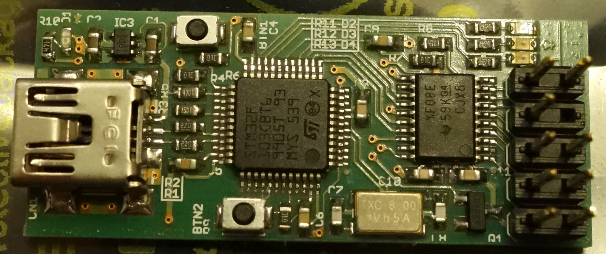
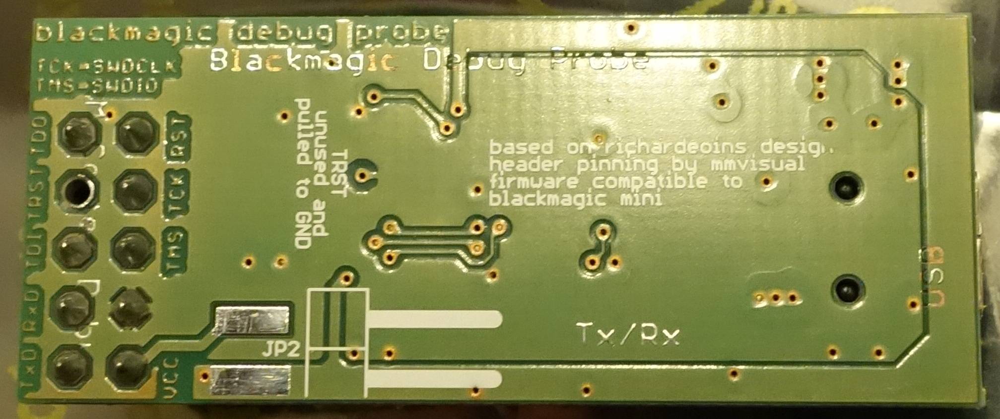

This version is based on [richardeoins](https://github.com/blacksphere/blackmagic-hardware/tree/master/contrib/richardeoin) hardware variant, but with the following changes:
* 1.27mm connector was replaced by a standard 2.54mm type
* the JTAG pinning was changed according to [mmvisual](https://www.mikrocontroller.net/articles/JTAG#Der_10-polige_JTAG_Stecker_von_mmvisual_.28ARM.2C_Cortex.2C_Seriell_kombiniert.29)
* ported to KiCad
* new board layout
* the board size is 41mm x 17mm.

This board has been built and it works.

The filenames are misleading, but were kept even after the conversion from EAGLE.

## Photos

The errors in the solder stop mask are fixed in the meantime.
